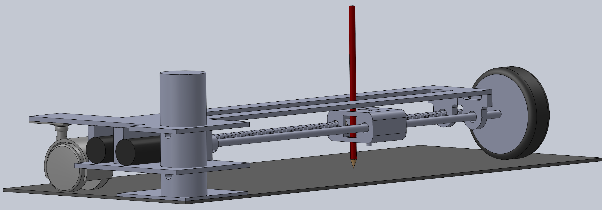
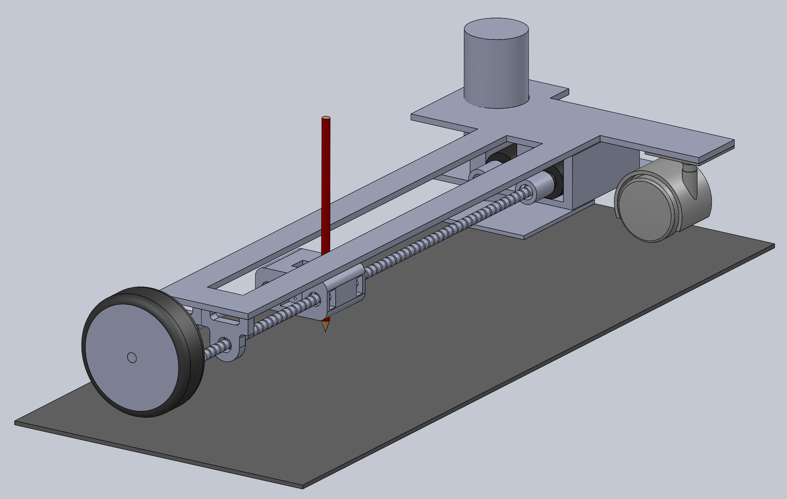

# ImagePlotter

## Proposal
We want to make a two and a half degree of freedom robot capable of drawing any image on a piece of paper from an uploaded image on our PC to create a masterpiece. The code will turn an image into a series of vectors that our system will draw the robot.

The device will use a rotating base with two motors mounted on top. One motor will spin a wheel to create rotational motion. Another motor will create linear motion that will move the pen linearly alongside a threaded shaft. The shaft will be parallel to each other and will be connected with bearings and the pen mount. This setup will allow the pen to mark up the entire page. We will be using a solenoid actuator and MOSFET to connect to the pen, and the solenoid will lift and lower the pen. Our complete setup will utilize a signal microcontroller taking commands from a PC. Our Patterson Gearmotors will require a larger voltage supply than our microcontroller can support, so we will be using the motor drivers with two H-bridges to control to control our motors in the project. 

__Figure 1:__ Back view of Solidworks model of 2.5 DOF Image Plotter Schematic.

__Figure 2:__ Front view of Solidworks model.

__Figure 3:__ Version 1 of 2.5 DOF Image Plotter Schematic project.

## Introduction

We created a two and a half degree of freedom robot capable of drawing any image on a piece of paper from an uploaded image on our PC. The code turns an image into a series of points that our system draws. The system will be using a radial and angular coordinate system. The device is intended as a fun activity for casual users. 

The device uses a rotating base with two motors mounted on top. One motor spins a wheel to create rotational motion. Another motor creates linear motion that moves the pen linearly alongside a threaded shaft. The shafts are parallel to each other and are be connected with bearings and the pen mount. This setup allows the pen to mark up the entire page. We use a solenoid actuator and MOSFET to connect to the pen, and the solenoid lifts and lowers the pen. Our complete setup utilizes a signal microcontroller taking commands from a PC. Our Patterson Gearmotors require a larger voltage supply than our microcontroller can support, so we use the motor drivers with two H-bridges to control our motors in the project.

## Hardware Design Overview

The hardware of the project consists of two motors, two rods, a breadboard, a mosfet, a solenoid, a mount and a wooden frame in order to hold the robot. The motors are in charge of moving the solenoid. One motor controls the radial distance from the mount while the second motor controls the angular coordinate. This allows the device to be able to go to all areas of the paper. The two rods are used as guiding rods for the solenoid to be able to move up and down. The solenoid is used to control the pen, whether or not it marks the paper. This is controlled by an input voltage into a mosfet that will either trigger the solenoid or not. The breadboard is used in order to provide a surface to connect electrical components. The wooden frame provides support for the entire system.

## Software Design Overview
The software is designed using a number of generators which operate as tasks scheduled in [main.py](https://github.com/danrmunic/ImagePlotter/blob/main/src/main.py). The motor task sends the desired position to the motors using a [motor_driver](https://github.com/danrmunic/ImagePlotter/blob/main/src/motor_driver.py) object and [ClosedLoop](https://github.com/danrmunic/ImagePlotter/blob/main/src/closedloop.py) object, as well as receiving the motor position using an [Encoder](https://github.com/danrmunic/ImagePlotter/blob/main/src/Encoder.py) object to check if a movement is finished. The user task recieves points from the serial port which are sent from the computer in [PC.py](https://github.com/danrmunic/ImagePlotter/blob/main/src/PC.py) (and generated in [sobel.py](https://github.com/danrmunic/ImagePlotter/blob/main/src/sobel.py)). The logic task does the math to convert those points from rectangular coordinates to values which can be sent to the motors in the polar coordinate system. Finally, the Solenoid task moves the pen up and down while drawing based on input from the computer.  

Variables are shared between tasks using Shares and Queues in [task_share.py](https://github.com/danrmunic/ImagePlotter/blob/main/src/task_share.py)

## Results Overview
The system was tested by sending a few pictures of squares as images. We noticed that when the image had short strokes, the machine was able to make precise movements and replicate it onto the paper. However, when there were large, signluar strokes, the machine would have difficulty recreating this image. This might be becaause the machine is working in radial and angular coordinates, so it struglles to be able to make straight lines.

## Expanding on the Process
In this project, we learned how useful it is to have a greater understanding of various components. The solenoid was extremely helpful in being able to move the sharpie up and down. It was difficult to integrate the entire system into one machine since there are multiple devices to connect with one another. However, when combined, they make a far more efficient machine than previously imagined. The best advice to give to someone who might expand on our current setup, would be to familiarize themselves with each component in order to create the best possible machine.

## BOM 
| Qty. | Part                  | Source                | Est. Cost | 
|:----:|:----------------------|:----------------------|:---------:|
|  2   | Pittperson Gearmotors     | ME405 Tub             |     -     |
|  1   | Nucleo with Shoe          | ME405 Tub             |     -     |
|  2   | Black & Red Sharpie&trade | Pre-Owned     |   -   |
|  1   | Motor Driver 2 H-bridges| ME405 Tub | - |
|  1   | 5A Power MOSFETs          | [DigiiKey](https://www.digikey.com/en/products/detail/stmicroelectronics/STN3NF06L/654517?s=N4IgjCBcoLQBxVAYygMwIYBsDOBTANCAPZQDaIALAJwDsIAugL6OEBMZIAygCoByAzLwBiABgBsAGQaMgA)        |   $3.80   |
|  1   | Solenoid Actuator        | [Digikey](https://www.digikey.com/en/products/detail/sparkfun-electronics/ROB-11015/6163694) | $4.95 |
|  1   | 1/4” Guide Rod 12” Long | ME405 Bin | - |
|  1   | 1/4” Threaded Rod 12” Long       | ME405 Bin | - |
|  1   | Rotating Base       | ME405 Bin | - |
|  1   | 3” Rubber Wheel       | [McMaster](https://www.mcmaster.com/wheels/wheels-4/rubber-wheels-7/) | $1.98 |
|  1   | Bearing Wheel       | Clayton | - |
|  2   | 1/4" Ball Bearing       | [servocity](https://www.servocity.com/1-4-bore-bottom-tapped-pillow-block/) | $14 |
|  2   | 3/8 to 1/4 Shaft Coupler       | [amazon](https://www.amazon.com/Stainless-Steel-Screw-Shaft-Coupler/dp/B00KVNA50G/ref=sr_1_3?crid=39PDB30GPBVOX&keywords=3%2F8+inch+to+3%2F8+inch+Stainless+Steel+Set+Screw+Shaft+Coupler&qid=1645675919&s=industrial&sprefix=3%2F8+inch+to+3%2F8+inch+stainless+steel+set+screw+shaft+coupler%2Cindustrial%2C110&sr=1-3) | $9.98 |
|  1   | Solenoid and pen platform | 3D Print |- |

## Microcontroller Classes

* [main.py](https://github.com/danrmunic/ImagePlotter/blob/main/src/main.py)
* [encoder.py](https://github.com/danrmunic/ImagePlotter/blob/main/src/Encoder.py)
* [motor_driver.py](https://github.com/danrmunic/ImagePlotter/blob/main/src/motor_driver.py)
* [closedloop.py](https://github.com/danrmunic/ImagePlotter/blob/main/src/closedloop.py)
* [task_share.py](https://github.com/danrmunic/ImagePlotter/blob/main/src/task_share.py)

## PC Classes
* [PC.py](https://github.com/danrmunic/ImagePlotter/blob/main/src/PC.py)
* [sobel.py](https://github.com/danrmunic/ImagePlotter/blob/main/src/sobel.py)

## Documentation

* [Image Plotter Documentation](https://github.com/danrmunic/ImagePlotter)

## Website Link

* [Image Plotter Website](https://danrmunic.github.io/ImagePlotter/index.html)

## Images used for testing

* [TestImages](https://github.com/danrmunic/ImagePlotter/tree/main/TestImages)
