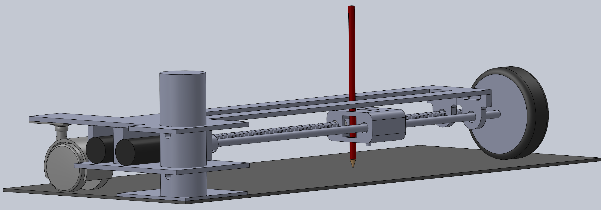
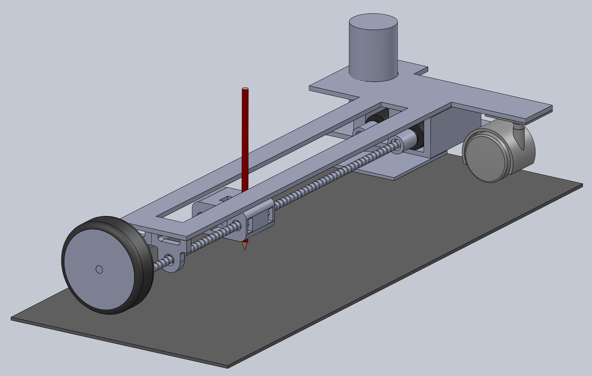

# ImagePlotter
We want to make a two and a half degree of freedom robot capable of drawing any image on a piece of paper from an uploaded image on our PC to create a masterpiece. The code will turn an image into a series of vectors that our system will draw the robot.

The device will use a rotating base with two motors mounted on top. One motor will spin a wheel to create rotational motion. Another motor will create linear motion that will move the pen linearly alongside a threaded shaft. The shaft will be parallel to each other and will be connected with bearings and the pen mount. This setup will allow the pen to mark up the entire page. We will be using a solenoid actuator and MOSFET to connect to the pen, and the solenoid will lift and lower the pen. Our complete setup will utilize a signal microcontroller taking commands from a PC. Our Patterson Gearmotors will require a larger voltage supply than our microcontroller can support, so we will be using the motor drivers with two H-bridges to control to control our motors in the project. 

__Figure 1:__ Back view of Solidworks model of 2.5 DOF Image Plotter Schematic.

__Figure 2:__ Front view of Solidworks model.

__Figure 3:__ Version 1 of 2.5 DOF Image Plotter Schematic project.

## BOM 
| Qty. | Part                  | Source                | Est. Cost | 
|:----:|:----------------------|:----------------------|:---------:|
|  2   | Pittperson Gearmotors     | ME405 Tub             |     -     |
|  1   | Nucleo with Shoe          | ME405 Tub             |     -     |
|  2   | Black & Red Sharpie&trade | Pre-Owned     |   -   |
|  2   | 5A Power MOSFETs          | [DigiiKey](https://www.digikey.com/en/products/detail/stmicroelectronics/STN3NF06L/654517?s=N4IgjCBcoLQBxVAYygMwIYBsDOBTANCAPZQDaIALAJwDsIAugL6OEBMZIAygCoByAzLwBiABgBsAGQaMgA)        |   $3.80   |
|  1   | 1/4” Guide Rod 12” Long | [servocity](https://www.servocity.com/0-375-3-8-x-12-00-stainless-steel-precision-shafting/) or ME405 Tub | $5.18 |
|  1   | 1/4” Threaded Rod 12” Long       | ME405 Tub | - |
|  1   | 3” Rubber Wheel       | [McMaster](https://www.mcmaster.com/wheels/wheels-4/rubber-wheels-7/) | $1.98 |
|  1   | 2.25” Chair Wheel       | [McMaster](https://www.mcmaster.com/24215T44/) | $2.30 |
|  1   | Solenoid Actuator        | [Digikey](https://www.digikey.com/en/products/detail/sparkfun-electronics/ROB-11015/6163694) | $4.95 |
|  1   | Rotating Base       | ME405 Tub | - |
|  2   | 3/8" Ball Bearing       | [servocity](https://www.servocity.com/3-8-bore-bottom-tapped-pillow-block/) | $12.74 |
|  2   | 3/8 to 3/8 Shaft Coupler       | [amazon](https://www.amazon.com/Stainless-Steel-Screw-Shaft-Coupler/dp/B00KVNACWC) | $9.98 |
|  1   | Solenoid and pen platform | 3D Print |- |

## Classes

## Documentation

## Website Link

#  \image html Task Diagrams.png "Figure 1: Task Diagram"  
#  @subsection User Task
# \image html User Task Diagrams.png "Figure 2: UserTask Diagram"  
#  @subsection Controller Task
#  
#  @subsection Encoder Task
# 
#  @subsection Motors Task
#  
#  @subsection Logic Task
# 
#  @subsection Solenoid Task

