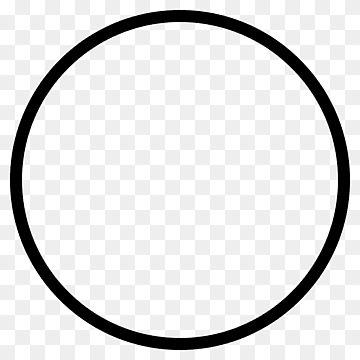

# ImagePlotter
__Authors: John Bennett, Daniel Munic, Rudi Diaz__ 
__Date Modified: March 15, 2022__

This README.md introduces the ImagePlotter project, a ME 405 project. It includes and overviews of the implemented hardware and softwear. And a disscussion of the results and what we have learned.

## Introduction
We created an imageplotter capable of moving a pen with 2.5 degrees of freedom The robot plots in polar (r,theta) coordinates and is able to turn its operation on and off, by lifting or dropping a pen. We rotate a threaded rod for radial tranlations and use direct drive to move our wheel around a fixed orgin to create the theta angle. A solinoid was used for lifting a pen. We communicate drawing instruction through the serial port from our PC. 

The project is intended to be operated by its creators: John Bennett, Daniel Munic, and Rudi Diaz since we have a deeper understanding of the code. But the device is intended for anyone that wants to use our image plotter. We have a file that converts an image into a printable textfile that is able to be interpreted by our code. So if anyone has an image we can print it!

The goal of this project was to create any desired image by generating a series of contors and sending individual commands to the robot until the master piece is done. We were able demonstrate that we accomplished this goal by drawing squares, circles and writing the word image.

## Hardware Design Overview
The image plotter hardware that is structuarl consists of a support bearing, a wooden bearings, a wooden frame, a wooden leg for bearing, and a rod at the orgin. The image plotter hardware that is non-structuarl consists of two Pittperson DC motors, a threaded rods, a direct drive shaft connected to a wheel, a sharpee, a breadboard, a 5A mosfet, a solenoid, a nucleo with a shoe, a 2 H-bridge motor driver, a limit switch, and a solenoid and pen carrage. For a full list of our hardware see the BOM below

### BOM 
| Qty. | Part                  | Source                | Est. Cost | 
|:----:|:----------------------|:----------------------|:---------:|
|  2   | Pittperson Gearmotors     | ME405 Tub             | - |
|  1   | Nucleo with Shoe          | ME405 Tub             | - |
|  2   | Black & Red Sharpie&trade | Pre-Owned             | - |
|  1   | Motor Driver 2 H-bridges  | ME405 Tub             | - |
|  1   | 5A Power MOSFETs          | [DigiiKey](https://www.digikey.com/en/products/detail/stmicroelectronics/STN3NF06L/654517?s=N4IgjCBcoLQBxVAYygMwIYBsDOBTANCAPZQDaIALAJwDsIAugL6OEBMZIAygCoByAzLwBiABgBsAGQaMgA)        |   $3.80   |
|  1   | Diode                     | ME405 Tub             | - |
|  1   | Solenoid Actuator         | [Digikey](https://www.digikey.com/en/products/detail/sparkfun-electronics/ROB-11015/6163694) | $4.95 |
|  1   | Limit Switch              | Gift                  | - |
|  1   | 1/4” Guide Rod 12” Long   | ME405 Bin             | - |
|  1   | 1/4” Threaded Rod 12” Long| ME405 Bin             | - |
|  1   | 3” Rubber Wheel           | ME405 Bin             | - |
|  2   | 3/8 to 1/4 Shaft Coupler  | [amazon](https://www.amazon.com/Stainless-Steel-Screw-Shaft-Coupler/dp/B00KVNA50G/ref=sr_1_3?crid=39PDB30GPBVOX&keywords=3%2F8+inch+to+3%2F8+inch+Stainless+Steel+Set+Screw+Shaft+Coupler&qid=1645675919&s=industrial&sprefix=3%2F8+inch+to+3%2F8+inch+stainless+steel+set+screw+shaft+coupler%2Cindustrial%2C110&sr=1-3) | $9.98 |
|  1   | Bearing Wheel             | Clayton               | - |
|  1   | Wooden Bearings           | Scrap Wood Bin        | - |
|  1   | Wooden Frame              | Scrap Wood Bin        | - |
|  1   | Wooden Wheel Leg          | Scrap Wood Bin        | - |
|  1   | Rotating Rod at Orgin     | ME405 Bin             | - |
|  1   | Solenoid and pen platform Carrage | 3D Print      | - |

The motors are in charge of moving the solenoid and pen carrage, which contains the sharpee and solenoid. One motor controls the radial distance by rotating the threaded shaft this pushes the solenoid and pen carrage along the shaft at about motor 1000 radians per about 8 inches of radial movement. The solenoid and pen carrage uses the direct drive shaft and wooden bearings to keep movement stable. The second motor controls the angular coordinate by using direct drive to move the wheel around a fixed rod at the orgin to create the theta angle, 20 radians on the motor is a 90 degree turn. We are also able to control when we lift and drop the pen using a solinoid. This allows the device to be able to draw on all areas of the paper. The solinoid is controlled by a mosfet when it is triggered the mosfet will allow current to flow from 5V to ground. We have a diode in parralel with the solinoid to protect our hardwear. The breadboard is used to provide a surface to connect electrical components. We have a limit switch which is mounted close to our motors. the limit switch allows up to locate the orgin when the solenoid and pen carrage crash into it. The wooden frame is what everything is mounted to and it provides support for the entire system. The support bearing adds another contact point to prevent the wooden frame from tilting. See figure 1 and 2 for hardware models. 

__Figure 1:__ Image Plotter Hardware.

__Figure 2:__ Top View of Image Plotter Hardware.

Figure 3 shows a close up view of our nucleo and breadboard and shows our wiring layout.

__Figure 3:__ Top View of Image Plotter Hardware.

## Software Design Overview
The software ran on the nucleo is designed using a number of generators which operate as tasks scheduled in [main.py](https://github.com/danrmunic/ImagePlotter/blob/main/src/main.py). These tasks are the motor task, user task, logic task, and solenoid task. The code ran in [main.py](https://github.com/danrmunic/ImagePlotter/blob/main/src/main.py) is meant to accept a singular rectangular coordinates from the user and convert them into motor angles. Then the motors will send the solenoid to that location. By using serial port communication we can continue to sent new rectangular cordinates until we have drawn a picture. Besides for accepting rectangular cordinates our code will also accept up "{" and down "}" commands to control the solinoid.

The motor task sends both motors to the desired position using a [motor_driver](https://github.com/danrmunic/ImagePlotter/blob/main/src/motor_driver.py) object and [ClosedLoop](https://github.com/danrmunic/ImagePlotter/blob/main/src/closedloop.py) object, as well as receiving the motor position using an [Encoder](https://github.com/danrmunic/ImagePlotter/blob/main/src/Encoder.py) object to check if a movement is finished. The user task recieves points from the serial port which are sent from the computer in [PC.py](https://github.com/danrmunic/ImagePlotter/blob/main/src/PC.py) (and generated in [sobel.py](https://github.com/danrmunic/ImagePlotter/blob/main/src/sobel.py)). The logic task does the math to convert those points from rectangular coordinates to values which can be sent to the motors in the polar coordinate system. Finally, the Solenoid task moves the pen up and down while drawing based on input from the computer.  

Variables are shared between tasks using Shares and Queues in [task_share.py](https://github.com/danrmunic/ImagePlotter/blob/main/src/task_share.py)

## Results Overview
Our system was able to draw a successful rectangle, circle, and the word image legibile. These images matched our jpg image. We will discribe our testing process as well as the tests we preformed

We first started with calculations to prediced how to move from a rectangular coordinates to motor angles. We needed relationships between motor angles to theta and radius, we got these values exerimentally by moving the motors. Nexted we checked if the robot could accept polar coordinates. We wanted to determine if the robot could move to the desired polar coordinate. We had to further tune parameters to get the accurace we wanted. Once we have achieved polar coordinates we then started inutting rectangular coordinates. Once we were confident in our robots ability to move from one point to the next we moved to drawing images. 

The system was first tested by sending a picture of a square. While drawing we noticed that when the machine had to draw short strokes, the machine was able to make precise movements and replicate it onto the paper. However, when we inputted large change in position the machine would have difficulty acuratlly creating this line. This might be because the machine is working in radial and angular coordinates, so it struggles to be able to make straight lines, Since the movement in the theta direction is significanly larger then the radial movement. As we progressed with the project, we were able to change the step size to get the best results. 

We had the system draw three figures. The first was a simple rectangle picture the rectangle was drawn baised on the png image in figure 4. Figure 5 shows the our mechines output drawing. As you can see, the image is not a perfect copy of the image in figure 4, this is due to the fact that due to the machine's coordinate system being cylidrical and has large controller gains. This allowed for slight discrepanies as the machine did it's best to copy the image but was unable to make perfect lines. However, the results are still pretty amazing as the image is easily recognizable to the original image.

__Figure 4:__ Png Image of a Rectangle

__Figure 5:__ System's Drawing of a Rectangle. (Ignore the word image in the center)

We drew another simle shape of a circle. this drawing was also retty good but we did not have smooth curves. The scaling of the circle was obviously scewed. See figures 6 and 7. The image looked good and were extreamly hay with these results.

__Figure 6:__ Png Image of a Circle.

__Figure 7:__ System's Drawing of a Circle.

The next image the machine drew was the word "IMAGE" as seen in figure 8. The drawing created by the robot can be seen in figure 9. Here we can see that the robot was able to replicate the drawing with a surprising amount of accuracy. One drawback was that machine took a large amount of time in order to complete this image as it could not move the pen at high speeds and the movements it made, while precise, were extremely small. We attempted to rectify this issue by having the machine draw every third point it recieved, but this led to errors so we removed this feature. 

__Figure 8:__ Png Image of the Word Image.

__Figure 9:__ System's Drawing of the Word Image.

As for the last image, we had the image attempt to draw former US president Barack Obama. This was by far the most detailed image which unfortunately led to being the hardest one to complete. With all the details required, the image created unfortunately was not able to be an exact copy of the image we had. It also took a long time as the machine tried to capture every last detail.

__Figure 10:__ Png Image of Obama.

__Figure 11:__ System's Drawing of Obama.

## Expanding on the Process
both systems should have similar movement seeds 

We learned that print timing is important

The purchused solinoid we not made to attatch to the to the en easielly.  We learned how imortant it isThis was a har

Having good controls, good resulution and a well tuned system helped emencly in our project 

In this project, we learned how useful it is to have a greater understanding of various components. The solenoid was extremely helpful in being able to move the sharpie up and down. It was difficult to integrate the entire system into one machine since there are multiple devices to connect with one another. However, when combined, they make a far more efficient machine than previously imagined. The best advice to give to someone who might expand on our current setup, would be to familiarize themselves with each component to create the best possible machine. 

## Additional files

### Microcontroller Classes

* [main.py](https://github.com/danrmunic/ImagePlotter/blob/main/src/main.py)
* [encoder.py](https://github.com/danrmunic/ImagePlotter/blob/main/src/Encoder.py)
* [motor_driver.py](https://github.com/danrmunic/ImagePlotter/blob/main/src/motor_driver.py)
* [closedloop.py](https://github.com/danrmunic/ImagePlotter/blob/main/src/closedloop.py)
* [task_share.py](https://github.com/danrmunic/ImagePlotter/blob/main/src/task_share.py)

### PC Classes
* [PC.py](https://github.com/danrmunic/ImagePlotter/blob/main/src/PC.py)
* [sobel.py](https://github.com/danrmunic/ImagePlotter/blob/main/src/sobel.py)

### Documentation

* [Image Plotter Documentation](https://github.com/danrmunic/ImagePlotter)

### Website Link

* [Image Plotter Website](https://danrmunic.github.io/ImagePlotter/index.html)

### Images Used For Testing

* [TestImages](https://github.com/danrmunic/ImagePlotter/tree/main/TestImages)
